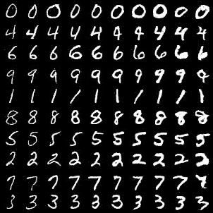
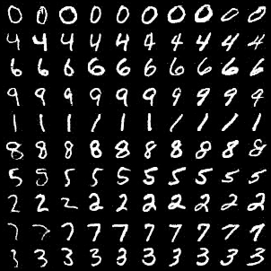
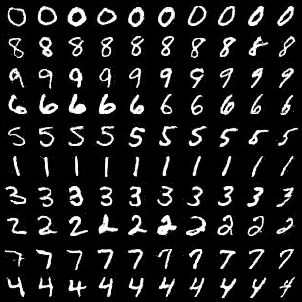
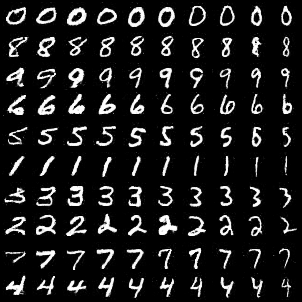
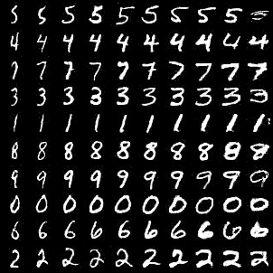
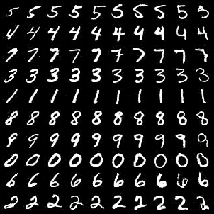
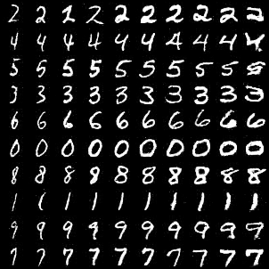
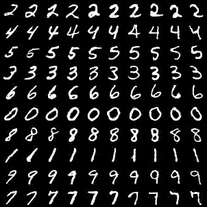
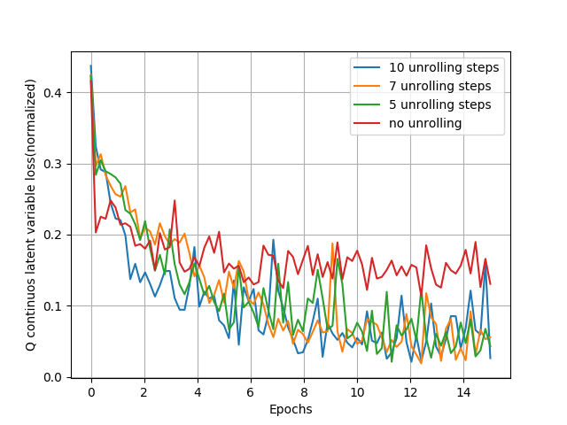
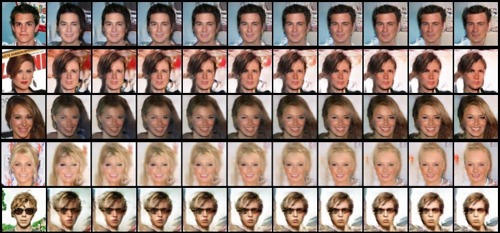

# disentangled-representation-learning
In this research project, I try to combine some ideas on generative networks and disentangled representation learning.

I have given a summary below. Please check out the [report](report.pdf) for more details.
I will clean up the code and put some documentation soon.

I experiment with two architectures which basically are combinations of multiple research papers:

1. **Unrolled InfoGAN**

   The intuition that led me here is that solving the quite common and frustrating problem of *mode collapse* in GANs should improve the disentangling performance of any GAN based disentangled representations learning model. In this case, I chose [InfoGAN: Interpretable Representation Learning by Information Maximizing Generative Adversarial Nets](<https://arxiv.org/abs/1606.03657>). What an InfoGAN tries to do is capture the modes of the data distribution in a way that individual latent units are sensitive to changes in a single mode. This is basically what disentangling is. But, it can’t do this if the generator can’t even capture all the modes of the data.

   There's this really good paper that tries to solve the problem of mode collapse in GANs and also stabilises their training - [Unrolled Generative Adversarial Networks](<https://arxiv.org/abs/1611.02163>). This paper defines the generator objective with respect to an unrolled optimisation of the discriminator.

   I use the method described in the above paper and check how it affects the disentangling performance of InfoGAN. I see a clear correlation between *unrolling* and increase in disentangling performance both by qualitatively observing samples and quantitatively comparing the losses.

2. **(Unrolled) VAEInfoGAN**

   This is a more ambitious combination and I have only added the good samples.(Yeah, that's right. I just confessed to kind of cherry-picking the results. I just put it here and in the report because I hope someone finds it interesting and explores it more. I might come back to it later, but right now I am spending my time learning reinforcement learning.)

   The crux of this idea is to replace the latent space of an InfoGAN(which includes both the latent code and the incompressible noise) with the latent space of a Variational Autoencoder(VAE). Then, like in InfoGANs, we take some of these latent variables and maximise the *mutual information* between them and the output of a *Q* network.

   Now, we can't directly replace the *pixel-wise likelihood maximisation* of a VAE with an *adversarial loss*. It's because with likelihood maximisation, we maximise the probability of each image whereas in an adversarial framework, all the generator has to do is generate something that looks like it came from the data. So, there's nothing forcing the generator(decoder) to reproduce the input of the encoder. Luckily, someone has already worked on this in this paper [Autoencoding beyond pixels using a learned similarity metric](<https://arxiv.org/abs/1512.09300>). So, the only thing I did is to add a *Q* network to a VAEGAN.

   Optionally, we can use the method of unrolling here as well to solve mode collapse and stability issues.

## Results

**Unrolled InfoGAN**:

Following are samples obtained by varying the two continuous latent variables and one discrete latent variable for all numbers of unrolling steps. Each has two images in which we vary the two continuous latent variables horizontally and the one discrete variable vertically.

It should be noted that following samples are as is with no hyperparameter tuning, so samples in the InfoGAN paper will be better than the first two samples, but the overall trend is still interesting.

|Unrolling steps|                    Thickness                    |                    Rotation                    |
| :-----------: | :---------------------------------------------------: | :---------------------------------------------------: |
| 0(InfoGAN) |  |  |
| 5           |  |  |
| 7           |  |  |
| 10           |  |  |

We can see that the disentangling performance gets better and better as we increase the number of unrolling steps.

It can be also verified by looking at the plot of the Q loss for the continuous variables. As we can see the discrete variable loss goes to almost zero even with no unrolling(digits are separated vertically), so it is not plotted.

**(Unrolled) VAEInfoGAN**:

These are some samples obtained by varying the latent variables of a trained VAEInfoGAN model on the CelebA dataset:

From top to bottom, the variables have learnt the following factors of variation:
1) Age 2) Gender 3) Hair color 4) Hair length 5) Sunglasses add/remove
